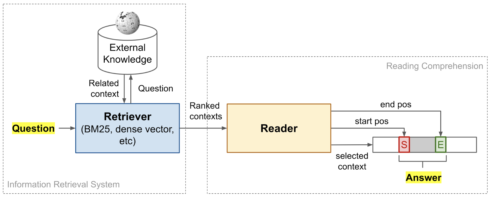

# QA German Finance News

## Description

### Introduction
The goal of this project is to evaluate German language models for question answering. Extensive research has been done on English question answering, however research in German texts is rather limited. 

For this project a dataset of German finance and economic texts, which were crawled from major German websites, was provided. Some of the websites include Abendblatt, Bild and Business Insider. In total, there were over 260.000 texts. The data was provided as a dataframe, and can be found in the directory data under the name "finance_news_de_2018-2022.csv".

Additionally, German language models by [deepset](https://www.deepset.ai) were used. [Deepset](https://www.deepset.ai) is a company specialized into NLP and semantic search. [Deepset](https://www.deepset.ai) developed an open source NLP framework called [Haystack](https://haystack.deepset.ai/overview/intro), which is the foundation of this project. The framework was developed for building search systems that work intelligently over large document collections. Hence, question answering is one of the major tasks that it was developed for.

To gain a deeper understanding of question answering,
please read 
[Retrieving and Reading : A Comprehensive Survey on Open-domain Question Answering](https://arxiv.org/pdf/2101.00774v3.pdf) and 
[Speech and Language Processing](https://web.stanford.edu/~jurafsky/slp3/ed3book.pdf).

### Method

#### Data
As in every NLP - supervised learning setup, test data is crucial. Traditionally, the creation of test data is a major bottleneck in NLP systems because it is created manually. In the context of question answering, test data consists of question answer pairs for each text.

###### Manual annotation

For this project, test data was manually annotated with the [annotation tool](https://annotate.deepset.ai/login) provided by [Haystack](https://haystack.deepset.ai/overview/intro). The manual annotation process looks like this:
* Create project for all question answer pair
* Upload a txt or csv text
* Under the tab "Documents" open the new text
* Click "Add custom question" button
* Write the question
* Select answer span from the text

As stated in the Introduction, the texts that I worked with, were given in a dataframe. The first step to start the annotation process, was to write each text from the dataframe into an individual txt file. This way, I could upload the individual texts into the annotation tool. Therefore, I created a notebook called ["pre-processing.ipynb"](https://git-dbs.ifi.uni-heidelberg.de/abasova/qa-german-finance-news/-/blob/main/pre-processing.ipynb), to create the individual txt files. The individual txt files can be found in the data directory under "split_files.zip". To avoid any information loss from this procedure, the title of the txt files contains the most important information. The title is in the format 

(domain uppercased)\_\_\_(dataframe index)\_\_\_(category).txt

Some sample file titles include ABENDBLATT.DE___287466___wirtschaft.txt, BILD.DE___253320___wirtschaft.txt and FOCUS.DE___38961___finanzen.txt.

##### Question Types
After the individual txt files were created, I uploaded 30 randomly selected files for manual annotation. To evaluate whether German language models perform the best on factoid or yes and no questions, I created three different projects in the annotation tool. Each project contains the same 30 texts that were randomly selected. For each text, the type of questions
is different. The first project contains factoid questions. These are questions, that ask for some fact and don't need any more context other than from the paragraph that the answer is from.
The second project contains yes questions. These questions would be answered with a yes in a conversation. However, in the task of question answering, the answer span that validates the question would be returned.
Finally the third project contains no questions, which are questions that are answered with a no in a conversation. Similar to yes-questions, the prediction from the system would be the answer span that invalidates the question content. For instance, for the question "Is the sun blue?", the QA system would return a span such as "The color of the sun is white", while in a conversation one would just answer "No". The following table shows the distribution of question answer pairs in the three projects.

| Question Type        | Number of examples           | Example of a question-answer pair|
| ------------- |:-------------:|:-------------:  |
| factoid questions      | 75 |Q: Bei welche Produkte dürfen Apotheken selbst den Preis festlegen?   A: Arzneimittel, für die es kein Rezept braucht|
| yes questions      | 39       | Q: Ist Bayer ein Chemiekonzern?    A: Agrarchemie- und Pharmakonzern (Bayer...)|
| no questions | 39      |    Q: Lag das durchschnittliche Eigenkapitalanteil beim Kauf von Immobilien im Jahr 2016 bei 5 Prozent?   A: Noch im Jahr 2016 brachten Bauherren und Käufer im Schnitt deutlich mehr als 20 Prozent Eigenkapital in ihre Finanzierung ein...|

##### Weak supervision approaches

To speed up the manual annotation process, I tried out three different weak supervision approaches. The idea was to create annotated data faster, by using generated questions from a pipeline as a suggestion. The centerpiece of all the approaches was the question generation pipeline, created by [Haystack](https://haystack.deepset.ai/overview/intro). The implementation can be found under ["Q-Generation.ipynb"](https://git-dbs.ifi.uni-heidelberg.de/abasova/qa-german-finance-news/-/blob/main/Q-Generation.ipynb). Note that weak supervision was only used to create factoid questions, hence to ask for some facts. 
Yes and No questions already contain some fact that they want to validate or invalidate. Haystack doesn't provide any pipeline to satisfy the linguistics of such questions.

The three approaches are described in the following:

1. Question Generation Pipeline

This pipeline generates questions given some text. This is the first pipeline, that was tried out. The results were overall not satisfactory but there are three major observations. 

First, the majority of the questions were in English. It is not clear why the pipeline returns primarily English questions and only a few German ones. I suspect that the model behind the pipeline ("valhalla/t5-base-e2e-qg") is the cause. You can see the results of the pipeline on one of the texts in the notebook ["Q-Generation.ipynb"](https://git-dbs.ifi.uni-heidelberg.de/abasova/qa-german-finance-news/-/blob/main/Q-Generation.ipynb).

Second, some questions mix English and German words. For instance, ”What has the Staatsanwaltschaft Stuttgart decided?”

Third, some generated questions are not meaningful. For instance, "How much did Audi owe Audi for dieselskandal?".

Fourth, German letters such as ü,ä and ö are consistenly found in correct words and are never missing. For instance, 
"Volkswagen hatte bei der Verkündung seiner Quartalszahlen bereits Rückstellungen in Höhe von einer Milliarde Euro bekanntgegeben, wie hoch?" Although the above sentence is not meaningful because it contains the answer to the fee question, it is interesting to see that the spelling is correct.

2. Question Generation Pipeline in combination with a Translation Wrapper Pipeline

In the second approach, the idea was to extend the pipeline from the first approach to combat the major problem of getting primarily English questions. Therefore, the same question generation pipeline is wrapped with a translation pipeline. The new pipeline translates the input text from German to English. Then, questions for the English text are created and finally translated back to German. 
Surprisingly, this approach returned solely English questions. However, the majority of the questions were semantically meaningful and didn't mix the question and answer in one sentence. Additionally, the minority of the questions were factoid. This behaviour was expected as news contain  time-dependent information.

3. Question Answer Generation Pipeline in combination with a Translation Wrapper Pipeline

In the final approach the question generation pipeline was replaced with a question answer generation pipeline. Note that in this approach not only the questions to a text are returned but also the corresponding answers. Similar to the previous step, the pipeline is wrapped with a translation pipeline to translate the input from the German to English and translate the question-answer pairs back to German. 

This approach performed the best. All question answer pairs were in German. This is surprising as the translation pipeline was identical to the one from the second weak supervision approach. The second weak supervision approach returned only English texts and the third one only German. This observation should be further investigated as it suggests inconsistency in the translation job. The second observation is that the minority of the questions are factoid. Finally, some question answer pairs don't make sense such as:

Q: Was ist der Grund, warum sich die Staatsanwaltschaft im Landkreis Stuttgart entschieden hat?

A: der Diesel-Skandal

### Experiments

#### QA Architecture
There are multiple architectures for question answering systems. This project focuses on the retriever-reader architecture, which is shown in the following illustration from [How to Build an Open-Domain Question Answering System?](https://lilianweng.github.io/posts/2020-10-29-odqa/#end-to-end-joint-training):

The system consists of two major components. The first component is the retriever and the second the reader. The retriever retrieves relevant document from some external knowledge base related to the question posed by a user. Retrievers usually return a small number of documents such as 5 or 10. Then the retrieved documents are forwarded to a reader with a rank. The reader reads the paragraphs of the documents and identifies the answer span within a paragraph. The resulting answer span is returned to the user as the answer to the user's question.

For more details please refer to the Sections 3.1.1, 3.1.2 and 3.3.1 from [Retrieving and Reading : A Comprehensive Survey on Open-domain Question Answering](https://arxiv.org/pdf/2101.00774v3.pdf).

#### Experiment Setup
For the experiments different retrievers and readers were tried out. 

Three different retrievers were used: 
* BM25
* TFIDF
* dense passage retriever

Seven different reader models were used: 

* 5 models provided by [deepset](https://www.deepset.ai)
    * roberta base English squad
    * electra base for German squad
    * electra large for German squad
    * electra base for German squad distilled bert base German cased
* 2 by deutsche telekom
    * deutsche telekom: electra base for German squad deutsche telekom: 
    * bert-multi-English-German squad

All readers and retrievers were loaded with default hyperparameters. For instance, [Haystack](https://haystack.deepset.ai/overview/intro) readers are loaded by default by using a GPU and with batch size of 50. However, the retrievers are set to return a maximum of 5 documents per query and the readers are set to return a maximum of 5 answers. Both readers and retrievers are allowed to return no answer predictions.

For the experiments all combinations of readers and retrievers were created. In total there were 21 combinations. Each reader-retriever combination was evaluated on the following metrics:

reader:

|metric |meaning  |
| ------------- |:-------------:|
 |exact match | predicted answers is identical to the ground truth|
|f1 | measures word overlap between the labeled and the predicted answer|
| semantic answer similarity (sas) | measures semantic similarity of the predicted and the correct answer instead of the lexical overlap|

retriever:

|metric |meaning  | value range |
| ------------- |:-------------:|:-------------:|
|recall multi hit  | computes how many of the multiple correct documents are retrieved for a query|[0, 5], 5 is the number of maximum documents allowed to retrieve in this project |
|recall single hit | computes whether at least one of the correct documents is retrieved for a query|[0,1]|
|precision | computes portion of correctly retrieved document among all retrieved documents|[0,1]|
|mean average precision (map)  |Map computes the average of ap (average precision) over a list of queries. Ap (average precision) computes the ratio of correctly retrieved document at different ranks such as 1, 2,3 etc.|[0,1]|
|mean reciprocal rank (mrr) |Mrr is the mean over each reciprocal rank of a query from a list of queries. A reciprocal rank is $ 1 \over rank $, where rank is the position of the top correctly retrieved documents for one query.| [0,1]|
|Normalized discounted cumulative gain (ndcg)| computes ratio of DCG (Discounted Cumulative Gain) to iDCG (ideal DCG). Discounted Cumulative Gain  | [0,1]

#### Evaluation Results
In this section I discuss the evaluation results. Please note that the evaluation was done in an integrated mode, which means that the output of the retriever is the input of the reader. Hence, in an integrated mode the performance of the entire system is tested under realistic and end-user circumstances.

For each question type, factoid yes and no (question type), two images are shown. The first image shows the evaluation of the retriever and the second image shows the evaluation of the reader. Both images show the result over all 21 reader-retriever combinations. 

1. Factoid Questions

Among the three retrievers, BM25 and TFIDF perform the best. TFIDF is best at retrieving multiple documents with an average of over 1.4 correct documents among the max of 5 documents that it was set to return. Additionallt, ndcg is 1 which means that the returned documents are all relevant and sorted with a descending relevance. It is quite unclear why map is higher than 1 with a value of 1.14. Map ranges by definition between 0 and 1. 

BM25 consistently recalls one of the relevant documents with a recall single hit of 1. Surprisingly, DPR performs consistently the worst. This observation is against latest research which suggests that DPR is more effective at retrieving documents.

Among the readers, german electra models trained on question answering perform the best. The large model, gelectra-large-germanquad performs best with a semantic answer similarity (sas) of 0.84 followed by gelectra-base-germanquad-distilled with a sas of 0.75 and electra-base-de-squad2 by Deutsche Telekom with a sas of 0.75. All three models predict about half of the answers identical to the correct answer.

%20Bar%20Chart.png)
%20Bar%20Chart.png)

2. Yes Questions

The results of the retrievers among factoid and yes questions are similar.
On yes questions TFIDF performs even better by retrieving 1.75 correct documents among the maximum 5 that it is allowed to retrieve. 
TFIDF achieves a map and ncdg above 1, which is surprising given that both metrics have an upper-bound of 1. BM25 consistently returns one relevant document for each query as recall-single-hit is 1. Again DPR performs significantly worse among all metrics.

Among the readers, models trained on German question answering perform similar. The semantic answer similarity is between 0.6 and 0.7. However, the exact match is significantly lower in comparison to factoid questions. On yes questions TFIDF in combination with German electra QA models performs the best with an exact match of only 0.2. The low result is 
related to the nature of the question. During the manual annotation process, I found yes and no questions the most difficult to annotate. The struggle was to find the ideal span, which provides enough context to validate the facts of the question without being unnecessarily long. 

%20Bar%20Chart.png)
%20Bar%20Chart.png)

3. No Questions

As the results are almost identical to the results of Yes questions, I won't analyse the results any further. Please refer to the discussion on Yes questions in the paragraph above.
%20Bar%20Chart.png)
%20Bar%20Chart.png)

### Conclusion

Overall, this project was very fun to implement. [Haystack](https://haystack.deepset.ai/overview/intro) provides a nice and intuitive framework to start deploying QA systems immediately. The framework is very flexible allowing to customize nodes such as retrievers to the own needs and at same time everything is setup as all components contain multiple hyperparameters with default values. Additionally, the framework is very efficient. Evaluation on GPU including loading 10 models from Huggingface usually lasted less than 15min. 

The annotation tool is also very handy. No matter how many documents and questions have been uploaded, the tool remains efficient. There are no lags or forced time to wait between submitting a question and marking its answer span. The annotation tool can be used locally, however I sticked to the online version. The only disadvantage of the annotation tool is that the file name can't be seen inside the tool once the file is uploaded. To avoid uploading the same file multiple times, the user has to keep track of the files that are in the tool manually. 

The question generation and question answer generation pipelines are interesting components of [Haystack](https://haystack.deepset.ai/overview/intro). I have used multiple questions from these pipelines to create the question answer pairs. These pipelines can't completely substitute manually annotated data, however they can be used as assistants to generate slightly more manual data. 

Furthermore, [Haystack](https://haystack.deepset.ai/overview/intro) provides a lot of support through slack and github. The team continues to extend and improve their framework, hence please check whether any of the previously mentioned negative experiences is still valid. 

### Future Work

From the observations of these projects there are multiple interesting questions to research in the context of question answering for the german finance and economic domain. The most important questions are the following:

1. Why does DPR perform consistently worst among the retrievers?

This is against common wisdom that DPR is a state-of-the-art retriever. Hence, it should be investigated whether DPR can be trained differently in order to perform well on German texts.

2. What is a good answer span?

This is a crucial question as question answering relies on a good answer span. Economic and financial texts have a short to medium length in comparison to legal texts. Therefore, it would be interesting to see whether a reader that returns the whole sentence, that contains the answer, would perform better. This approach is practical as end-user which pose the query would be willing to read a short or medium long sentence that satisfies their information need. This approach was suggested by my superviser after discussing the difficulties of finding a good answer span on yes and no questions. Personally, I believe that this approach is the most promising to answer yes and no questions given that they contain a higher information density which needs to be validated or invalidated.

3. How could we improve question generation pipelines?

This is also a very interesting question. In question answering the effort of manual annotation is higher in comparison to other NLP tasks such as sequence labeling. In QA the annotator has to define a question with synonyms of the answer context and find a short answer span. There are multiple weak supervision approaches available for other NLP tasks provided by libraries such as SpaCy, however no approach exists for QA. To accelerate research on QA improving the performance of weak supervision approaches is essential. 

## Roadmap

This project has shown multiple advantages and disadvantages of German language models provided by Haystack. For future use cases it is essential to improve the performance of weak supervision approaches as they combat the bottleneck of manual annotation.

One of the most exciting use cases for German language models in the finance domain is the creation of a QA plugin for confluence. The financial industry experiences a drastic increase of regulatory requirements on its IT-systems and processes. The implementation of each regulatory requirement consists of multiple steps that are usually documented in lengthy confluence pages. As the number of confluence projects and pages increases along with the regulatory requirements, finding a confluence page of interest becomes a time-consuming task. Given that a user broadly knows what his information need is about, the user could pose a question to the QA system, which is inside the plugin. 
As QA systems are able to understand synonyms, a QA system could find the relevant confluence page even when the question contains synonyms of the correct confluence page. For instance, DSGVO is always related to personal data. Hence a retriever should learn to retrieve confluence pages about GSGVO for questions that contains the words "personal data".
